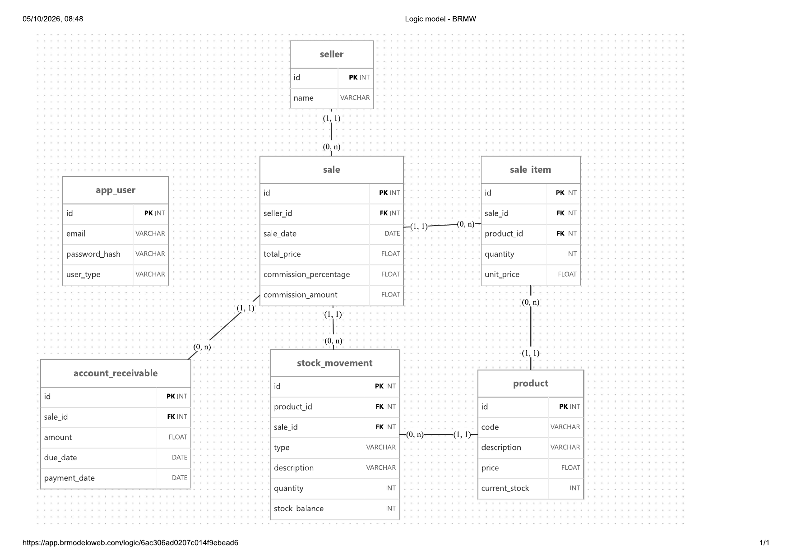
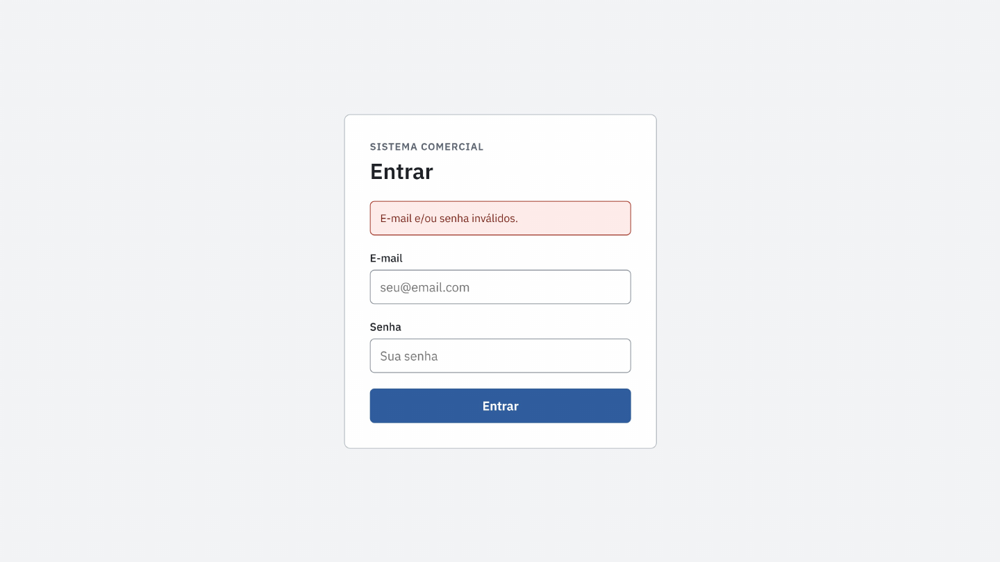
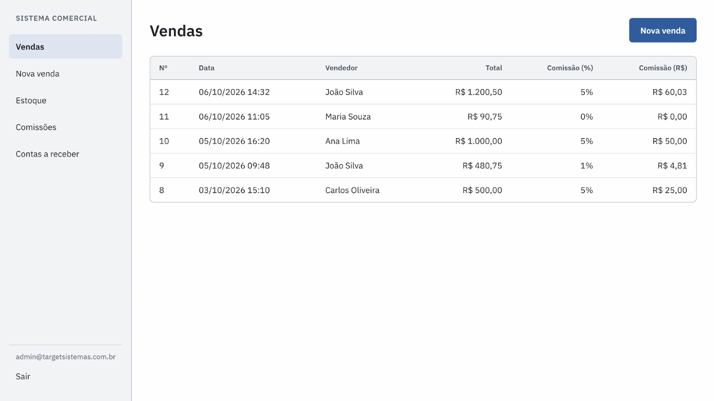
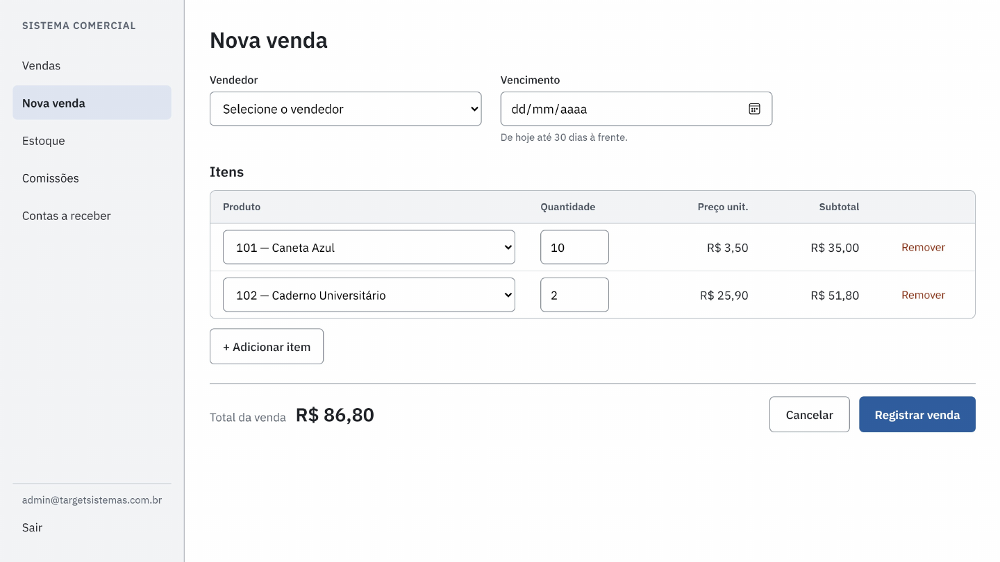
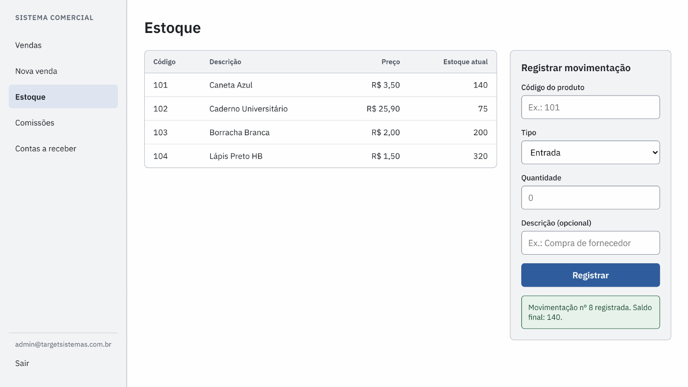
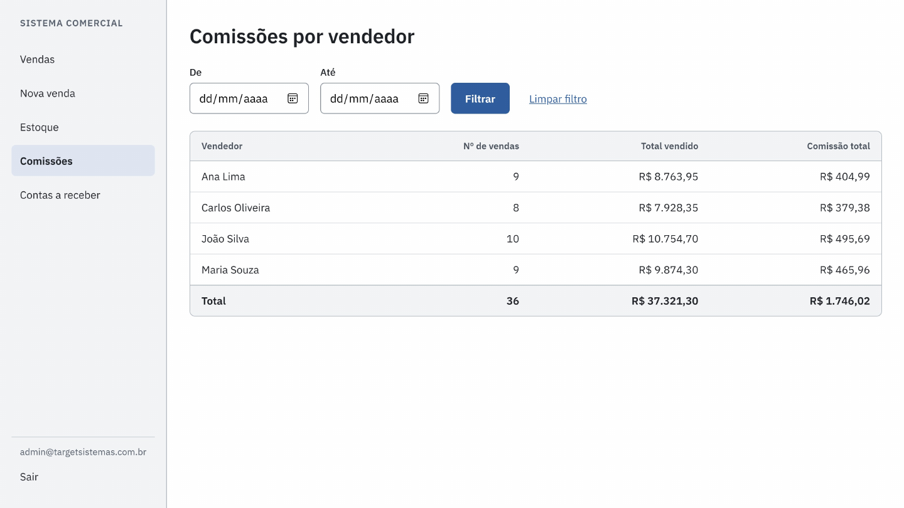
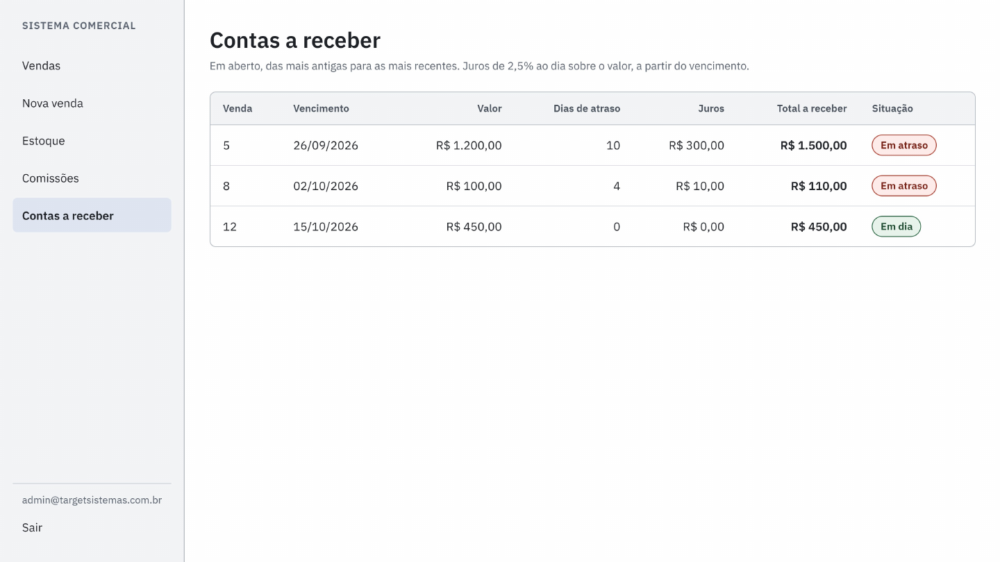

<p align="center">
  
</p>

<h1 align="center">Desafio Target Sistemas</h1>

<p align="center">
  Um mini sistema comercial que integra os três exercícios do desafio técnico — comissão, estoque e juros — num só produto, com API, banco e front-end.
</p>

<p align="center">
  
  
  
  
</p>

<p align="center">
  <a href="https://www.google.com"><strong>Acessar o sistema</strong></a> ·
  <a href="#telas-wireframe">Ver as telas</a> ·
  <a href="#como-rodar-localmente">Rodar localmente</a> ·
  <a href="especificacoes/">Especificações</a>
</p>

---

## Em produção

| | Endereço |
|---|---|
| **Front-end** (GitHub Pages) | https://www.google.com |
| **API** (Azure App Service) | https://desafio-target-sistemas-gqhzb5ggc2dccwa5.centralus-01.azurewebsites.net/api/hml |

As credenciais de acesso foram enviadas junto com o link deste repositório.

---

## Sumário

- [O desafio original](#o-desafio-original)
- [Como os três temas se conectam](#como-os-três-temas-se-conectam)
- [Estrutura do repositório](#estrutura-do-repositório)
- [Modelo de dados](#modelo-de-dados)
- [Arquitetura do back-end](#arquitetura-do-back-end)
- [Autenticação](#autenticação)
- [Internacionalização](#internacionalização)
- [Tratamento de erros](#tratamento-de-erros)
- [Endpoints](#endpoints)
- [Front-end](#front-end)
- [Telas (wireframe)](#telas-wireframe)
- [Banco de dados: scripts](#banco-de-dados-scripts)
- [Como rodar localmente](#como-rodar-localmente)
- [Deploy](#deploy)
- [Decisões de negócios e melhorias além do pedido original](#decisões-de-negócios-e-melhorias-além-do-pedido-original)
- [Fora do escopo](#fora-do-escopo)

---

## O desafio original

O desafio ([`especificacoes/desafio_dev.docx`](especificacoes/desafio_dev.docx)) trazia três exercícios independentes:

1. **Comissão de vendas.** Dado um JSON com vendas (`vendedor`, `valor`), calcular a comissão de cada vendedor: menos de R$ 100 não gera comissão, de R$ 100 a R$ 499,99 gera 1%, a partir de R$ 500 gera 5%.
2. **Movimentação de estoque.** Dado um JSON de produtos (`codigoProduto`, `descricaoProduto`, `estoque`), permitir lançar entradas e saídas, cada uma com um identificador único e uma descrição, devolvendo a quantidade final do estoque movimentado.
3. **Juros por atraso.** A partir de um valor e uma data de vencimento, calcular o juro do dia de hoje, à taxa de 2,5% ao dia.

Cada um, isoladamente, poderia ser um script de console. A decisão deste projeto foi tratá-los como **três regras de negócio de um mesmo sistema comercial**: um admin que faz login, consulta vendas, estoque, comissões e contas a receber, e registra novas vendas.

## Como os três temas se conectam

| Tema do desafio | Onde vive no sistema |
|---|---|
| Comissão | Calculada e **gravada** no momento da venda (`sale.commission_percentage`, `sale.commission_amount`), para não mudar retroativamente se a regra evoluir |
| Estoque | Cada item de uma venda gera uma **saída** de estoque (`stock_movement`, `type = OUT`) vinculada àquela venda. Entradas avulsas (compra de fornecedor, ajuste) passam pela mesma tabela, sem vínculo com venda |
| Juros | Toda venda gera uma **conta a receber** (`account_receivable`) com data de vencimento. O juro não é gravado: é calculado **na consulta**, a partir do vencimento e da data de hoje |

Registrar uma venda, portanto, é uma única transação que cria a venda, os itens, a comissão, as saídas de estoque e a conta a receber — tudo ou nada.

## Estrutura do repositório

```
DesafioTargetSistemas/
├── especificacoes/            desafio, modelo do banco, scripts SQL e wireframe
├── src/
│   ├── backend/               API em .NET 10 (DDD, 6 projetos)
│   └── frontend/              HTML, CSS e JavaScript
└── DesafioTargetSistemas.slnx
```

## Modelo de dados

<p align="center">
  <a href="especificacoes/banco/modelo_logico.pdf">
    
  </a>
</p>

<p align="center"><sub>Clique na imagem para abrir o PDF original (brModelo).</sub></p>

O modelo lógico foi desenhado antes do código. No banco físico, os tipos ficaram mais precisos do que no diagrama: valores em dinheiro como `DECIMAL(18,2)` (e não `FLOAT`, que acumula erro de arredondamento), datas de venda e de movimentação com hora (`DATETIME2`), e constraints de `UNIQUE` e `CHECK` que o diagrama não representa. O script completo está em [`query_base.sql`](especificacoes/banco/query_base.sql).

Decisões de modelagem que valem registrar:

- **`app_user` é independente do resto.** Só serve para login.
- **`seller` (vendedor) não loga**, é cadastro de negócio. Separá-lo do usuário do sistema evitou acoplar autenticação a uma entidade que não precisa dela.
- **`stock_movement.sale_id` é opcional**, e uma `CHECK` constraint garante que uma entrada (`IN`) nunca tem venda associada. Só a saída (`OUT`) pode ter, e mesmo assim não é obrigatório: uma perda ou ajuste de inventário também é uma saída, sem venda.
- **Comissão e preço são snapshot.** `sale.commission_percentage`, `sale.commission_amount` e `sale_item.unit_price` gravam o valor **do momento da venda**. Se o preço do produto ou a regra de comissão mudarem depois, o histórico continua correto.
- **Juros não têm coluna.** Eles dependem de "hoje", então um valor gravado estaria desatualizado no dia seguinte. A API sempre calcula na hora de responder.
- **Estoque negativo é barrado no próprio banco** (`CHECK current_stock >= 0`), além da validação da API.
- **Nomes em inglês no banco, mensagens em português para o usuário.** `product`, `code` e `type IN/OUT` seguem o padrão técnico; as mensagens de erro (`.resx`) são traduzidas.

## Arquitetura do back-end

Camadas, no estilo DDD, com SOLID e injeção de dependência:

```
Api            → Controllers finos, filtros de exceção e de autenticação
Application    → Casos de uso (UseCases) e validadores (FluentValidation)
Domain         → Entidades, interfaces de repositório, regras de negócio puras
Infrastructure → EF Core, repositórios, geração/validação de token, DI
Communication  → Requests e Responses (contratos JSON da API)
Exception      → Hierarquia de exceções de negócio e mensagens (.resx)
```

Regra de dependência: `Api → Application → Domain`, e `Infrastructure → Domain`. O `Domain` não conhece banco, HTTP nem bibliotecas externas: guarda entidades, interfaces e regras.

**Regras de negócio puras, testáveis sem banco:**

- `CommissionCalculator`: as três faixas de comissão do desafio.
- `InterestCalculator`: os 2,5% ao dia, juros simples sobre o valor em aberto.

Cada caso de uso segue o mesmo formato: valida o request (FluentValidation), busca o que precisa nos repositórios, aplica a regra, grava tudo num único `UnitOfWork.Commit()` quando há escrita, e devolve um Response enxuto — nunca a entidade crua.

## Autenticação

- **Login:** `POST /login` recebe e-mail e senha, confere o hash com **BCrypt** (a senha nunca é gravada em texto puro; o hash do admin é gerado por um script à parte, já que não há endpoint de cadastro de usuário) e devolve um **JWT**.
- **Validação do token:** feita por um filtro de autorização próprio (`AuthenticatedRequestFilter` + atributo `[AuthenticatedUser]`), que verifica assinatura e expiração e devolve as respostas no mesmo formato de erro do resto da API, inclusive um sinalizador `tokenIsExpired` para o front saber quando pedir login de novo.
- Todo controller que precisa de login herda de uma base com `[AuthenticatedUser]`. O de login fica de fora, porque quem ainda não entrou não tem token.

## Internacionalização

As mensagens de erro vêm de arquivos de recurso (`.resx`), com inglês como idioma padrão e tradução para `pt-BR`. Um middleware próprio (`CultureMiddleware`) lê o header `Accept-Language` da requisição, respeitando a prioridade declarada pelo cliente (`q=`), e define a cultura antes do controller rodar. O front-end sempre envia `Accept-Language: pt-BR`.

Para adicionar um novo idioma, basta criar, no projeto `Exception`, um arquivo `ResourceMessageException.<cultura>.resx` com as mesmas chaves do arquivo padrão (ex.: `ResourceMessageException.es.resx` para espanhol) e incluir a cultura em `Settings:Localization:SupportedCultures` no `appsettings.json` (ou nas variáveis de ambiente, em produção).

## Tratamento de erros

Toda exceção de negócio herda de uma base comum (`DesafioTargetSistemasException`), que carrega a lista de mensagens e o status HTTP correspondente. Um `ExceptionFilter` converte isso numa resposta padronizada:

```json
{ "errors": ["Estoque insuficiente para esta saída."] }
```

Erros de validação (FluentValidation) podem devolver várias mensagens de uma vez. Requisições malformadas (JSON inválido, tipo errado, enum inexistente) também respondem nesse formato. Qualquer exceção não prevista vira um `500` com uma mensagem genérica, sem expor detalhes internos a quem chamou a API.

## Endpoints

Prefixo: `/api/hml`

| Método | Rota | Autenticado | O que faz |
|---|---|---|---|
| `POST` | `/login` | não | Autentica e devolve o token |
| `GET` | `/sellers` | sim | Lista vendedores |
| `GET` | `/sellers/commissions?from=&to=` | sim | Total vendido e comissão por vendedor, com filtro de período opcional |
| `GET` | `/products` | sim | Lista produtos com estoque atual |
| `POST` | `/stockmovements` | sim | Registra entrada ou saída de estoque e devolve o identificador e o saldo final |
| `POST` | `/sales` | sim | Registra uma venda completa (itens, comissão, baixa de estoque, conta a receber) |
| `GET` | `/sales` | sim | Lista vendas, com vendedor e comissão |
| `GET` | `/accountsreceivable` | sim | Lista contas em aberto, com dias de atraso, juros e total |

Em ambiente de desenvolvimento, a documentação interativa da API (OpenAPI + Scalar) fica disponível em `/scalar`.

## Front-end

HTML, CSS e JavaScript puro — sem framework e sem bundler —, para manter o projeto simples e focado no desafio. JavaScript em **módulos ES** (`import`/`export`), organizado por responsabilidade:

```
frontend/
├── index.html                 tela de login
├── pags/                      as outras telas (uma página HTML cada)
│   ├── vendas.html
│   ├── nova-venda.html
│   ├── estoque.html
│   ├── comissoes.html
│   └── contas-a-receber.html
├── css/                       estilos (base, layout, componentes e um arquivo por tela)
└── js/
    ├── config.js              endereço da API e constantes
    ├── services/
    │   ├── api.js             fetch central: token, idioma, tratamento de erro
    │   └── auth.js            guarda/lê o token, protege páginas
    ├── utils/
    │   └── format.js          formatação de dinheiro, datas, texto seguro
    ├── components/
    │   ├── alert.js           caixa de erro/sucesso
    │   └── sidebar.js         menu lateral
    └── pages/                 um arquivo js por tela
        ├── login.js
        ├── vendas.js
        ├── nova-venda.js
        ├── estoque.js
        ├── comissoes.js
        └── contas-a-receber.js
```

O token fica no `localStorage`. Uma resposta `401` limpa o token e volta para o login, distinguindo expiração de token inválido, e uma página protegida não reaparece pelo botão "Voltar" depois do logout.

## Telas (wireframe)

As telas foram desenhadas antes do front-end, como guia de layout ([PDF completo](especificacoes/wireframe/Wireframe_-_Sistema_Comercial__Admin_.pdf)). A interface final segue o mesmo desenho; os valores das imagens são de exemplo.

<table>
  <tr>
    <td align="center" width="50%">
      <a href="especificacoes/wireframe/1-login.png"></a>
      <br><sub><b>Login</b> — mensagem genérica para e-mail ou senha inválidos</sub>
    </td>
    <td align="center" width="50%">
      <a href="especificacoes/wireframe/2-vendas.png"></a>
      <br><sub><b>Vendas</b> — data, vendedor, total e comissão de cada venda</sub>
    </td>
  </tr>
  <tr>
    <td align="center">
      <a href="especificacoes/wireframe/3-nova-venda.png"></a>
      <br><sub><b>Nova venda</b> — itens, total em tempo real e vencimento em até 30 dias</sub>
    </td>
    <td align="center">
      <a href="especificacoes/wireframe/4-estoque.png"></a>
      <br><sub><b>Estoque</b> — saldo atual e registro de entradas e saídas</sub>
    </td>
  </tr>
  <tr>
    <td align="center">
      <a href="especificacoes/wireframe/5-comissoes.png"></a>
      <br><sub><b>Comissões</b> — total vendido e comissão por vendedor, com filtro de período</sub>
    </td>
    <td align="center">
      <a href="especificacoes/wireframe/6-contas-a-receber.png"></a>
      <br><sub><b>Contas a receber</b> — dias de atraso, juros e total a receber</sub>
    </td>
  </tr>
</table>

## Banco de dados: scripts

Todos em [`especificacoes/banco/`](especificacoes/banco/):

| Arquivo | Para que serve |
|---|---|
| `query_base.sql` | Cria a estrutura (tabelas, constraints, índices), sem dados |
| `seed_desafio.sql` | Limpa os dados e popula o banco com os dois JSONs do desafio (vendedores, vendas, produtos, estoque inicial), com os vínculos de itens, movimentações de estoque e contas a receber, incluindo contas em aberto, vencidas e pagas para demonstração. Não altera o usuário de login |
| `espelho_banco.xlsx` | Retrato os dados do banco criado no Azure SQL Database, não reflete o banco local |
| `modelo_logico.pdf` | Modelo lógico do banco (brModelo) |

## Como rodar localmente

**Banco:** crie um Azure SQL Database (ou um SQL Server local) e rode `query_base.sql`, depois `seed_desafio.sql`. O usuário de login é inserido à parte em `app_user`, com a senha já em hash BCrypt.

**API:**
1. Configure a connection string e a chave de assinatura do JWT em `appsettings.Development.json` (fora do controle de versão).
2. `dotnet run` no projeto `DesafioTargetSistemas.API`.
3. Libere o CORS (`AddCors`/`UseCors` em `Program.cs`) para a origem onde o front vai rodar.

**Front-end:**
1. Em `js/config.js`, aponte `API_URL` para o endereço da API local.
2. Sirva a pasta com um servidor local (ex.: Live Server do VS Code). Módulos ES não funcionam abrindo o arquivo direto no navegador (`file://`).

## Deploy

- **Banco:** Azure SQL Database.
- **API:** Azure App Service. Segredos (connection string, chave JWT) ficam nas variáveis de ambiente do portal, nunca no repositório.
- **Front-end:** GitHub Pages, com `config.js` apontando para a URL pública da API e a origem do Pages liberada no CORS da API.

## Decisões de negócios e melhorias além do pedido original

O desafio não pedia nada disto, mas foi incorporado por fazer sentido num sistema real:

- **O próprio formato do projeto.** Em vez de três scripts isolados, os três exercícios viraram um mini sistema comercial completo, com banco, API, autenticação e interface, em que comissão, estoque e juros são consequências de um mesmo evento: a venda.
- **Vencimento de venda não pode ser retroativo, nem passar de 30 dias à frente**, validado no front e na API.
- **E-mail ou senha inválidos devolvem a mesma mensagem genérica**, para não revelar quais e-mails estão cadastrados.
- **Mensagens de erro em dois idiomas** (inglês e português), escolhidas pelo header `Accept-Language`.
- **Índice parcial** em `account_receivable` (só contas em aberto), já que é a consulta mais frequente dessa tabela.
- **`stock_movement` nasce pensando em dois tipos de lançamento**: o automático, gerado pela venda, e o manual (compra, ajuste), registrado pela tela de estoque.

## Fora do escopo

Para manter o projeto do tamanho de um desafio técnico, ficaram de fora: cadastro de usuário, vendedor e produto pela interface (hoje via seed/SQL direto), baixa de pagamento de contas pela interface, paginação nas listagens, renovação de token (refresh token) e cancelamento de token antes da expiração.

---

<p align="center">
  Desenvolvido por <strong>Williansberg Ribeiro da Silva</strong> como desafio técnico para o processo seletivo da <strong>Target Sistemas</strong>.
</p>

<p align="center">
  <a href="https://www.linkedin.com/in/williansberg-ribeiro-perfil/?isSelfProfile=true">LinkedIn</a> ·
  <a href="https://github.com/Will-Ribeiro00">GitHub</a> ·
  <a href="mailto:william.ribeiro1403@gmail.com">E-mail</a>
</p>

<p align="center"><sub>2026</sub></p>
